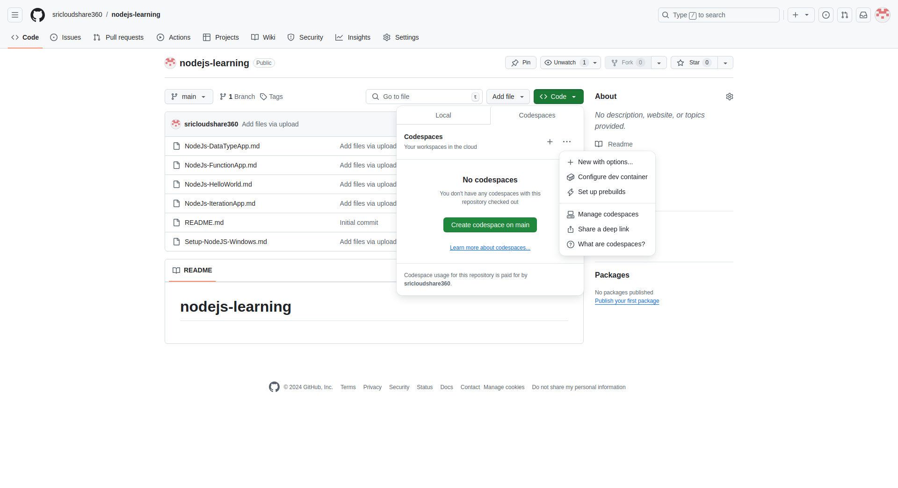
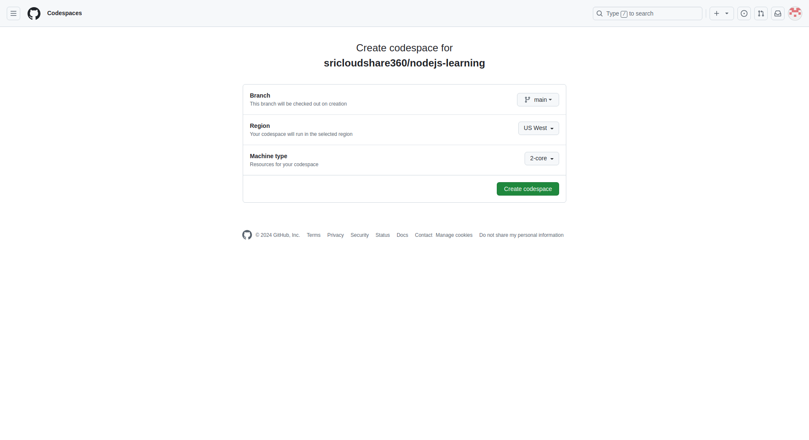
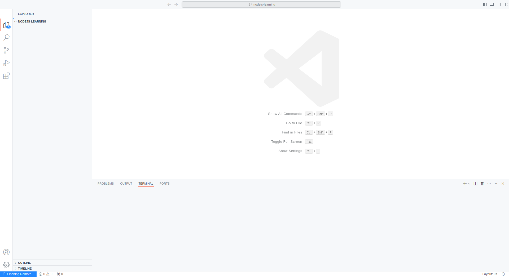
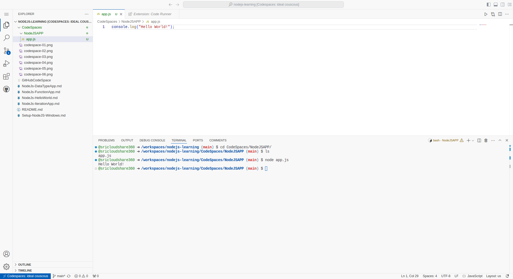

# Setting up code spaces - dev environment
## Step-00 - create a github Repo

Once you create you git repo. Create a new gitRepo.
Add an readm.md file as part of the repo. Then you see option "<>Code" DropDown Button as show in below Image

### Step-02 - Selecting CodeSpace for the current github Repo,
###            Selecting tab "CodeSpace" as show in the screenshot

### Step 3: Selecting Options
Click on , Click on "..." next to CodeSpaces 

### Step 4: Selecting New with Options
Click on it, Click on "+ New with Options..."

### Step 5: Selecting Machine Type and Creating CodeSpaces
Machine Type Select Drop Down

Machine Type Select 4-Core [16BM RAM -32 GB] and click on "Create codespace" Green Button

### Step 6: VSCode in the browser
This will open VS Code on The browser

### Step 7: Creating NodeJSApp

Created a Folder "NodeJSAPP", created a file app.js" ; showcasing how to run the nodejs file in the commandline where it is printing HelloWorld
