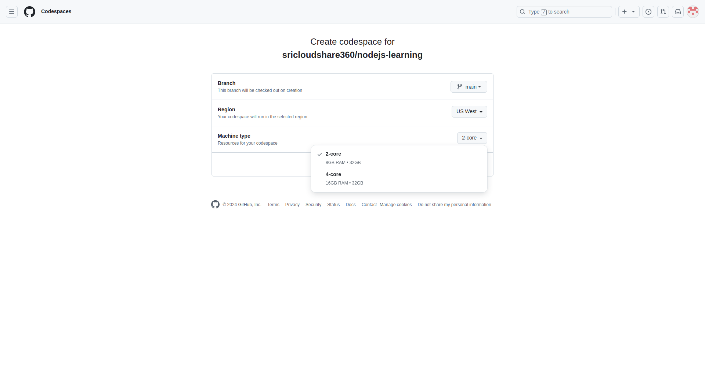

# CodeSpaces - Development Environment using VS online using CodeSpaces

## Step1: Opening CodeSpaces from your github Repo
Ensure that you Create a github Repo, Add a readme.md file to the repo. This will enable you to see the "<>Code> in Green Color

### Click on ...  to open Pop up Dialog Box, ### Select New With Option

### Select Machine Type to 4 Cores from DropDown

### Showcasing the Option for 2 core and 4 cores

### Create Code Space Button

### VSCode is on Browser

### Create Folder "NodeJSAPP"
#### Create a file app.js
Showcasing how to run app.js from console.log

### One can open code spaces using Browser
