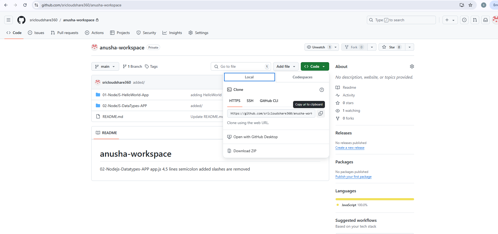
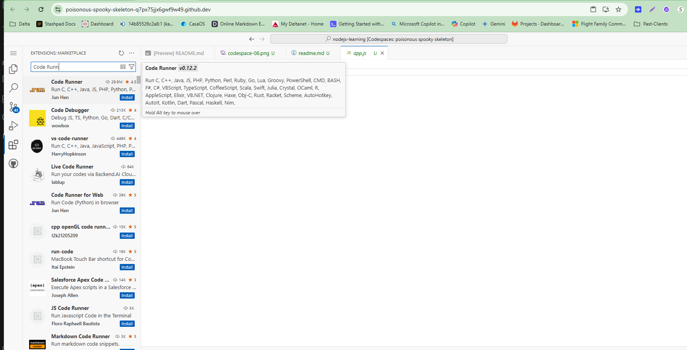

Open below link

[DevSpaces](
https://www.redhat.com/en/technologies/cloud-computing/openshift/try-it?sc_cid=7013a000003ScmnAAC&gad_source=1&gclid=CjwKCAjwyfe4BhAWEiwAkIL8sAuFf-OR4xpfHyEDLMEiMeG1sE-1slpehd-d7bUK59DL3Qz9yHdHBxoCw1kQAvD_BwE&gclsrc=aw.ds)
You will be redirected to Below link where you find Developer Sandbox
## Click on "Start your Trail"

## Click on Register

Verification Email Page

Click on Getting Started 

Copy the github Link 

Succffully Opened VSCode from Redhat DevSpaces

Installing Code Runner Extension

Alternativly you can select multiple templates provided by developer sandbox

